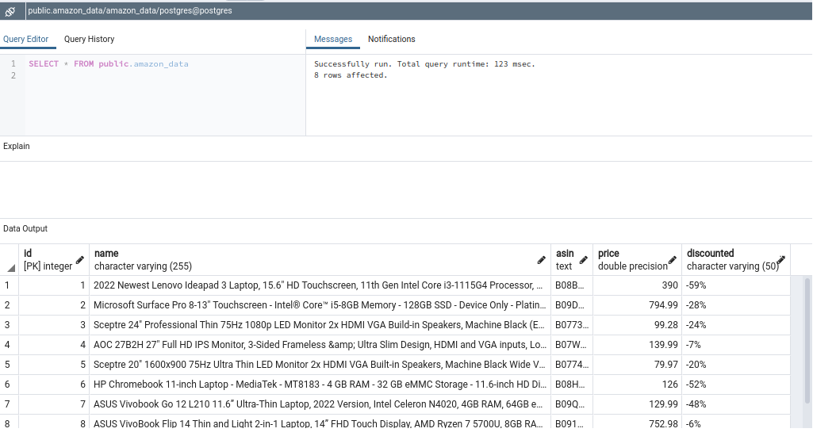

# Python Amazon Scraper

[](https://github.com/KenMwaura1/py-amazon-scraper/actions/workflows/pythonpackage.yml)

This project utilizes the Scrapy framework to scrape [amazon]() for data. Currently, it retrieves laptop data(name, price and discount). However you can configure this as needed.



[](https://choosealicense.com/licenses/mit/)


## Tech Stack

**Database:** Postgres DB

**Server:** Python, Scrapy


## Run Locally

Clone the project

```bash
  git clone https://github.com/KenMwaura1/py-amazon-scraper
```

Go to the project directory

```bash
  cd py_amazon_scraper
```

Install dependencies

```bash
  pip Install -r requirements
```

Change into the project directory
```bash
  cd amz_scraper
```
Start the spider

```bash
  scrapy crawl amznspider
```


## License

[MIT](https://choosealicense.com/licenses/mit/)


## Feedback

If you have any feedback, please reach out to me at kemwaura@gmail.com

## Authors

- [@KenMwaura1](https://github.com/KenMwaura1)

